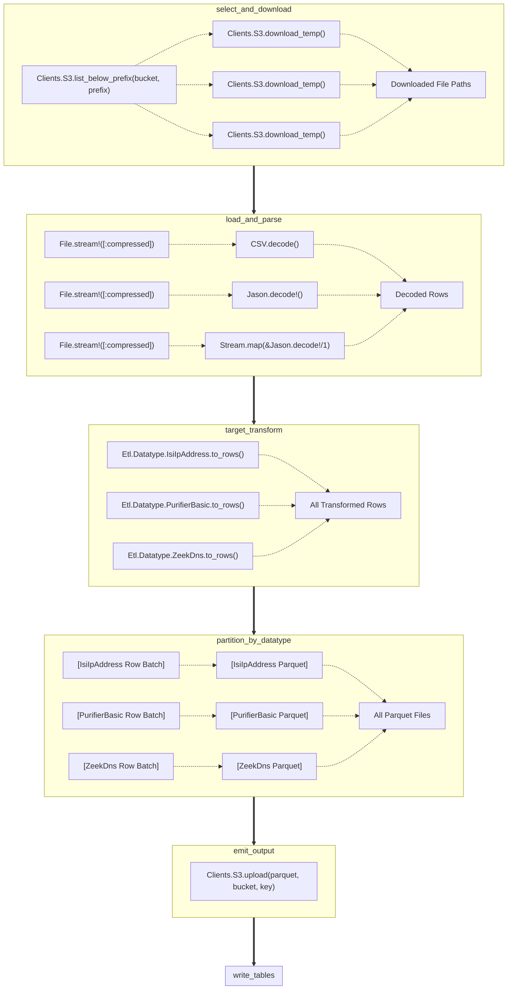

# Fishbowl ETL

## select_and_download

Takes as input a data source location. Could be a file path, S3 path, or a Redis instance, etc.

The files from the selected data source are turned into a flow wherein each file is downloaded to a temporary directory.

## load_and_parse

Each file in the input flow is loaded as a potentially compressed file stream.

The streams get decoded by either inferring the type from the path (e.g. "test.json.gz" -> :json, "test.csv.gz" -> :csv) or by using a target's default configured datatype.

Outputs a flow of parsed data rows.

## target_transform

Using the given target's list of datatypes, each datatype is flat mapped against the incoming stream of rows.

Datatypes can drop rows not intended for them and generate more rows than originally present.
`N` rows are transformed into `N * D` rows where `D` is the number of applicable datatypes.

## partition_by_datatype

The incoming flow of transformed rows is partitioned at this stage into separate swim lanes in preparation to write datatype-specific Parquet files.

Rows tagged by datatype are aggregated into chunks of `1_000_000` rows.

## emit_output

Each Parquet file is uploaded to S3 or written to disk depending on user-provided options.

## write_tables

Tables are written to Presto depending on which datatypes emitted Parquet files.
